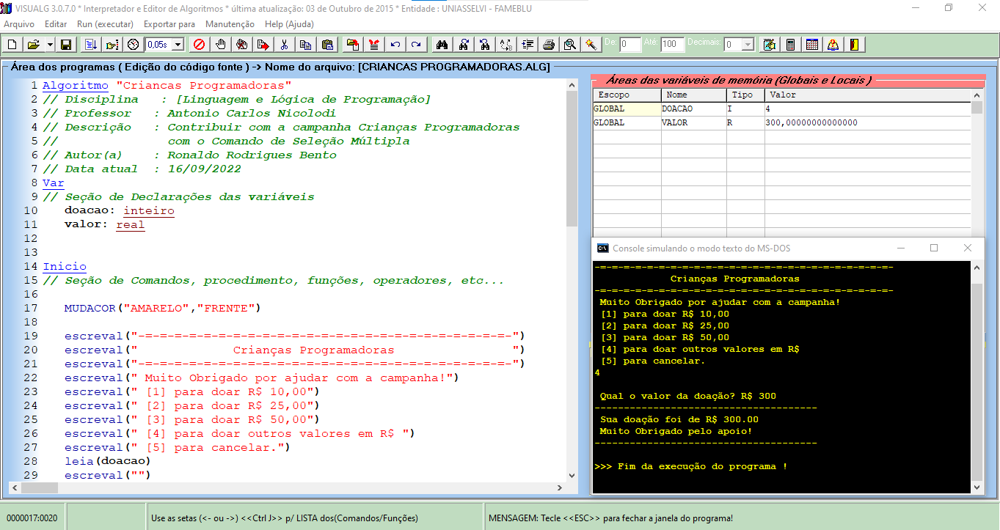

# visualg

## Exercícios com o editor e interpretador de Algoritmos - Visualg

<br>

## O que seria o VisuAlg?

<p>O VisuAlg é um programa que permite criar, editar, interpretar e que também executa os algoritmos em portugol (estruturado português) como se fosse um “programa” normal de computador.

É um programa de livre uso e distribuição GRÁTIS, e DOMÍNIO PÚBLICO, usado para o  ensino de lógica de programação em várias escolas e universidades no Brasil e no exterior.</p>

## O que tem no VisuAlg?

<p>O VisuAlg possui recursos como simulação da “tela” do MS-DOS, visualização de variáveis, “breakpoints”, com ajuda on-line, exporta o algoritmo para um código similar na linguagem Pascal, impressão dos fontes e outras características que auxiliam no aprendizado das técnicas de programação.

Foi propositadamente criado para ajudar aos alunos iniciantes em programação, mas pode ser utilizado por professores e outros autodidatas.

<strong>Sobre a Versão 2.5</strong>
A versão 2.5 do software foi a última criada pelo professor <em>Cláudio Morgado de Souza</em>, junto com o professor Antonio. O professor Morgado pediu ao professor Antonio (que já realizava a manutenção dessa versão há muitos anos, desde seu lançamento), para que este continuasse a dar continuidade ao seu projeto para atender aos milhares de usuários que este software tinha, pois iria abandonar por motivos pessoais.</p>

<br>

## Exemplos de Algoritmos em VisuAlg

```visualg
Algoritmo "Criancas Programadoras"
// Disciplina   : [Linguagem e Lógica de Programação]
// Professor   : Antonio Carlos Nicolodi 
// Descrição   : Contribuir com a campanha Crianças Programadoras
//               com o Comando de Seleção Múltipla
// Autor(a)    : Ronaldo Rodrigues Bento
// Data atual  : 16/09/2022
Var
// Seção de Declarações das variáveis 
   doacao: inteiro
   valor: real


Inicio
// Seção de Comandos, procedimento, funções, operadores, etc... 

   MUDACOR("AMARELO","FRENTE")

   escreval("-=-=-=-=-=-=-=-=-=-=-=-=-=-=-=-=-=-=-=-=-=-=-=-=-=-")
   escreval("             Crianças Programadoras                ")
   escreval("-=-=-=-=-=-=-=-=-=-=-=-=-=-=-=-=-=-=-=-=-=-=-=-=-=-")
   escreval(" Muito Obrigado por ajudar com a campanha!")
   escreval(" [1] para doar R$ 10,00")
   escreval(" [2] para doar R$ 25,00")
   escreval(" [3] para doar R$ 50,00")
   escreval(" [4] para doar outros valores em R$ ")
   escreval(" [5] para cancelar.")
   leia(doacao)
   escreval("")

   escolha doacao
           caso 1
                valor <- 10
           caso 2
                valor <- 25
           caso 3
                valor <- 50
           caso 4
                escreva(" Qual o valor da doação? R$ ")
                leia(valor)
           caso 5
                valor <- 0
           outroCaso
                    escreval(" Opção Inválida!")
   fimEscolha
   escreval("--------------------------------------")
   escreval(" Sua doação foi de R$ ", valor:5:2)
   escreval(" Muito Obrigado pelo apoio!")
   escreval("--------------------------------------")
   
Fimalgoritmo

```
***

```visualg
Algoritmo "IMC"
// Disciplina   : [Linguagem e Lógica de Programação]
// Professor   : Antonio Carlos Nicolodi 
// Descrição   : Calculo do IMC com Estrutura Condicional Aninhada
// Autor(a)    : Ronaldo Rodrigues Bento
// Data atual  : 16/09/2022
Var
// Seção de Declarações das variáveis 
        M, A, IMC: real

Inicio
// Seção de Comandos, procedimento, funções, operadores, etc... 
      MUDACOR("AMARELO","FRENTE")

      Escreva(" Informe sua Massa (Kg): ")
      Leia(M)
      Escreva(" Informe sua Altura (m): ")
      Leia(A)
      IMC <- M / (A ^ 2)    // Fórmula do Calculo do IMC
      EscrevaL(" IMC: ", IMC:5:2)
      Se (IMC < 17) entao
         EscrevaL (" Muito abaixo do Peso.")
      senao
           Se (IMC >= 17) e (IMC < 18.5) entao
              EscrevaL (" Abaixo so Peso.")
           senao
                Se (IMC >= 18.5) e (IMC < 25) entao
                   EscrevaL (" Peso ideal.")
                senao
                     Se (IMC >= 25) e (IMC < 30) entao
                        EscrevaL (" Sobrepeso.")
                     senao
                          Se (IMC >= 30) e (IMC < 35) entao
                             EscrevaL (" Obesidade.")
                          senao
                               Se (IMC >= 35) e (IMC < 40) entao
                                  EscrevaL (" Obesidade Severa.")
                               senao
                                    EscrevaL (" Obesidade Morbida.")
                               FimSe
                          FimSe
                     FimSe
                FimSe
           FimSe
      FimSe

Fimalgoritmo

```

***

## IMPORTANTE:
 
 Neste projeto, estou promovendo mais de 150 exercícios de algoritmo.

 [](https://github.com/RonaldoBento/visualg/blob/main/LICENSE) 
 
 <p>Você tem todo o direito de usar esse material para seu próprio aprendizado. Espero que seja útil o conteúdo disponibilizado. É preciso instalar o programa Visualg.</p><br>
